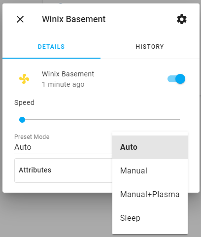

# Summary

A custom component to interact with Winix [C545](https://www.winixamerica.com/product/certified-refurbished-c545-air-purifier/) Air Purifier. This has also been reported to work with models [AM90](https://www.winixamerica.com/product/am90/) and [HR1000](https://www.amazon.com/Winix-HR1000-5-Stage-Enabled-Cleaner/dp/B01FWS0HSY).

# Installation

This can be installed by copying all the files from `custom_components/winix/` to `<config directory>/custom_components/winix/`.

Next you would define the credentials in `configuration.yaml`. You will need to signup for a Winix account and add your purifiers in the mobile app.

Example:

```yaml
winix:
  username: winix_email
  password: winix_password
```

This will generate entities and sensors whose id is based on the mac address.

Sample `fan.winix_abcdefghijkl` entity:

```
speed_list:
  - 'off'
  - auto
  - low
  - medium
  - high
  - turbo
  - sleep
speed: low
mode: auto
airflow: low
aqi: 1
plasma: 'off'
filter_hour: 126
air_quality: good
air_qvalue: 0
ambient_light: 2
location: MDNWI
filter_replace_date: '2020-10-01 23:31:09.0'
friendly_name: Winix Basement
supported_features: 1
```

Sample `sensor.winix_qvalue_abcdefghijkl` sensor:

```
air_quality: good
friendly_name: Winix Basement
```

- The purifier entity supports speed and preset mode.

  

- The device data is fetched every 30 seconds.
- There are 3 new services `winix.plasmawave_off, winix.plasmawave_on, plasmawave_toggle` in addition to the default fan services `fan.speed, fan.toggle, fan.turn_off, fan.turn_on, fan.set_preset_mode`.
  - The valid present modes are:
    - `Auto` or `1`
    - `Auto (PlasmaWave off)` or `2`
    - `Manual` or `3`
    - `Manual (PlasmaWave off)` or `4`
    - `Sleep` or `5`

- If purifiers are added/removed, then you would want to restart HomeAssistant.


Note: **Winix does not support simultaneous login from multiple devices. If you logged into the mobile app after configuring HomeAssistant, then the HomeAssistant session gets flagged as invalid and vice-versa.**

